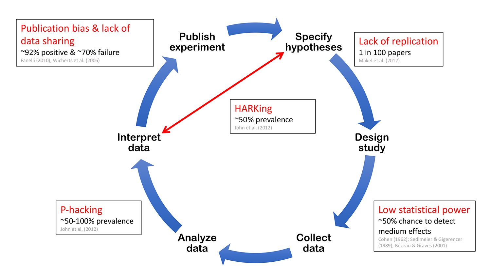

# slu_open_science_fika

Preparation for the Open Science at SLU on 2023-10-25.

 * [View the proposal (.pdf)](Proposal-National-guidelines-for-open-science.pdf)

## Abbreviations

 * KB: Kungligt Biblioteket

## Response to letter

## Abstract

I think the proposal by KB
is a step in the right direction,
unconvincing to any critical reader, 
and has no effect on the most prevalent problems,
hence I share a proposal that
will address these.
I will clarify my points here, in the hope to convince KB to make some changes.
However, I can imagine there is an unpublished strategy behind this proposal
and I will definitely give KB the benefit of the doubt in being 
more strategic than I am.
Whatever KB chooses to do, I will applaud their push for more Open Science.

## A step in the right direction

I think the proposal by KB
is a step in the right reaction: to me, 
Open Science is a pleonasm, so making science more Open
is making science more what it should be.
Such a transition takes time and multiple steps.
The six focus area in the proposal are simply that:
the next steps. The next steps, after which there will be more.
This is similar to the advice given to researchers 
that just discovered Open Science:
do one step at a time and gradually build up the Openness
of your research.
I agree that the steps suggested by KB are steps in the right direction,
I can (and will) challenge that it is steps that should be first. 

## Unconvincing to any critical reader

I think the proposal by KB is unconvincing to any critical reader,
even though there is a rationale given for each of the six areas.
The reason the rationales are unconvincing, is because a critical reader
will ask for a reference to the literature, as well as an effect size.

To illustrate with an example, 
I will use the first line 
of the section 'Rationale for open research methods', which reads:
'Open research methods enhance the quality of research through increased reproducibility'.
No reference. On which research do the authors base this statement on?
Assuming the statement is true, the next question will be:
how much is the quality of the research increased?
And how much higher is the quality of the research?
This helps determine the reader if this focus area is worth it.

One reference relevant for this example 
could be [Soderberg et al., 2021], where reviewers
were asked to grade papers for multiple criterial 
on a -4 ('very bad') to 4 ('very good') Rickert scale.
These papers were either 'regular' papers or registered reports (more on those
in the next section). It was found that registered reports
scored better on all criteria. On such criteria is 'Method quality',
where 'regular' papers score 0.29 on average, where registered reports scored.
1.05. Rescaling these values from a [-4, 4] to a [0, 8] scale 
(by simply adding 4.0), results in values 4.29 and 5.05 respectively.
From that one can conclude that registered reports have an 18% higher method quality.
If that percentage is worth it, is still an open question.

Also the bigger picture lacks references and effect sizes, 
underselling the importance of Open Science.
For example, section 1 of the proposal claims
'Open science lays the foundation for future
research through [...] reproducible research methods [...]'.
A critical reader will wonder how reproducible 'regular' research methods are,
to determine this indeed is a problem.
One example is a study that found that 50% of scientists 
cannot reproduce their own work [Baker, 2016].
A second example is about papers in in pre-clinical cancer research, 
of which only 11% of the findings could be replicated [Begley and Ellis, 2012].

Note that it will be very easy to add more references to papers
dealing with the reproducibility of research, by simply using
the search term 'Replication crisis'.

## No effect on the most prevalent problems

I state that the KB proposal has no effect on the most prevalent
problems.
Here I show two studies, one about the prevalence of
questionable research practices (QRPs) and one about
threats to reproducible research.

The first study is a study in which thousands of
scientists anonymously filled in a survey
regarding questionable research practices 
they commit [Gopalakrishna et al., 2021].
The most prevalent QRPs are listed
below (the percentage indicates the
percentage of scientists that did this QRP), 
where only the last point is addressed by the KB proposal:

%   | QRP                                                |Addressed by KB proposal
----|----------------------------------------------------|------------------------
17.5| No submission of a valid negative finding          |No
17.0| Not mentioning flaws in the study                  |No
15.0| Too little supervision                             |No
14.7| Too little attention to proper use of technology   |No
14.5| Too little documentation of the scientific process |Yes

> Table 1. Frequencies of the 5 most occurring QRPs, from [Gopalakrishna et al., 2021].

> Threats to reproducible science, adapted from [Munafò et al., 2017].
> (note that there is an online version with different, incorrect values)

The second study is a manifesto for reproducible science [Munafò et al., 2017],
which aligns closely with the KB proposal, 
as both papers intend 
to increase the reproducibility of science.

Frequency                                                                    |Threat to reproducible research|Addressed by KB proposal
-----------------------------------------------------------------------------|-------------------------------|------------------------
70-92% [Fanelli, 2010]                                                       | Publication bias              |No
~70% [Wicherts et al., 2006]                                                 | Lack of data sharing          |Yes
~1% of papers [Makel et al., 2012]                                           | Lack of replication           |No
~54% [John et al, 2012]                                                      | HARKing                       |No
Median of 0.46 power for medium size effect [Sedlmeier and Gigerenzer, 1992] | Low statistical power         |No
~60~70% [John et al, 2012]                                                   | P-value hacking               |No

> Table 2. Frequencies of threats to reproducible research, 
> references from [Munafò et al., 2017]. 
> Note that these values can be for a single (e.g. [Makel et al., 2012]) 
> or multiple (e.g. [Fanelli, 2010]) disciplines.

Table 2 shows the frequencies of threats to reproducible research.
Of these 6 threats, only 1 is addressed by the KB proposal.

## A proposal that does have an effect

The studies mentioned in the previous section both mention a
solution: registered reports.
A registered report starts with the description of
the experiment before any data is collected.
This draft is published online and then reviewed.
If the paper passes the review, the actual data is collected
and the experiment is performed. 
After a simpler second review (to test if the experiment was 
carried out as promised), the paper is published.

The goal of a registered report is increase the reproducibility of science
and it addresses more of the items in Tables 1 and 2, 
as shown in Tables S1 and S2.
My suggestion would be to mention registered reports as a 7th area.

## Discussion

Although I took some time to search through the academic literature,
by no means have I done a full literature review.
Most of the studies I used in this text I learned at Open Science Uppsala,
the local Open Science community in Uppsala,
where I can imagine there is a bias for studies that favor Open Science.

Additionally, I assume KB thought well about the suggested 6 areas
and I have no information on how and why these 6 were selected.
Maybe I am missing something, maybe it is a strategy to start
with those: I cannot know.

However, as I do believe that Open Science is a pleonasm, I welcome
every step to make science live up to its ideals.

Richèl Bilderbeek

## References

 * [Soderberg et al., 2021] Soderberg, Courtney K., et al. "Initial evidence of research quality of registered reports compared with the standard publishing model." Nature Human Behaviour 5.8 (2021): 990-997.
 * [Baker, 2016] Baker, Monya. "1,500 scientists lift the lid on reproducibility." Nature News 533.7604 (2016): 452.
 * [Begley and Ellis, 2012] Begley, C. Glenn, and Lee M. Ellis. "Raise standards for preclinical cancer research." Nature 483.7391 (2012): 531-533.
 * [Gopalakrishna et al., 2021] Gopalakrishna, Gowri, et al. "Prevalence of questionable research practices, research misconduct and their potential explanatory factors: a survey among academic researchers in The Netherlands." (2021).
 * [Munafò et al., 2017] Munafò, Marcus R., et al. "A manifesto for reproducible science." Nature human behaviour 1.1 (2017): 1-9.
 * [Fanelli, 2010] Fanelli, Daniele. "“Positive” results increase down the hierarchy of the sciences." PloS one 5.4 (2010): e10068.
 * [Wicherts et al., 2006] Wicherts, Jelte M., et al. "The poor availability of psychological research data for reanalysis." American psychologist 61.7 (2006): 726.
 * [Makel et al., 2012] Makel, Matthew C., Jonathan A. Plucker, and Boyd Hegarty. "Replications in psychology research: How often do they really occur?." Perspectives on Psychological Science 7.6 (2012): 537-542., Matthew C., Jonathan A. Plucker, and Boyd Hegarty. "Replications in psychology research: How often do they really occur?." Perspectives on Psychological Science 7.6 (2012): 537-542.
 * [John et al, 2012] John, Leslie K., George Loewenstein, and Drazen Prelec. "Measuring the prevalence of questionable research practices with incentives for truth telling." Psychological science 23.5 (2012): 524-532.
 * [Sedlmeier and Gigerenzer, 1992] Sedlmeier, Peter, and Gerd Gigerenzer. "Do studies of statistical power have an effect on the power of studies?." (1992).

## Supplementary materials

%   | QRP                                                |Addressed by registered report
----|----------------------------------------------------|------------------------
17.5| No submission of a valid negative finding          |Yes
17.0| Not mentioning flaws in the study                  |Yes
15.0| Too little supervision                             |No
14.7| Too little attention to proper use of technology   |No
14.5| Too little documentation of the scientific process |Yes

> Table S1. Frequencies of the 5 most occurring QRPs, from [Gopalakrishna et al., 2021].

Frequency                                                                    |Threat to reproducible research|Addressed by registered report
-----------------------------------------------------------------------------|-------------------------------|------------------------------
70-92% [Fanelli, 2010]                                                       | Publication bias              |Yes
~70% [Wicherts et al., 2006]                                                 | Lack of data sharing          |Yes
~1% of papers [Makel et al., 2012]                                           | Lack of replication           |No
~54% [John et al, 2012]                                                      | HARKing                       |Yes
Median of 0.46 power for medium size effect [Sedlmeier and Gigerenzer, 1992] | Low statistical power         |Yes
~60~70% [John et al, 2012]                                                   | P-value hacking               |Yes

> Table S2. Frequencies of threats to reproducible research, 
> references from [Munafò et al., 2017]. 
> Note that these values can be for a single (e.g. [Makel et al., 2012]) 
> or multiple (e.g. [Fanelli, 2010]) disciplines.
